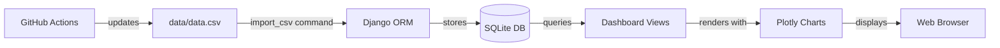

# Django Dashboard Setup Plan

## Project Structure

We'll create a Django project called `jobmarket_watch` with a main app called `dashboard` to display the job market data.

```
jobmarket-watch/
├── jobmarket_watch/          # Django project directory
│   ├── __init__.py
│   ├── settings.py
│   ├── urls.py
│   ├── wsgi.py
│   └── asgi.py
├── dashboard/                # Django app for web interface
│   ├── models.py            # JobData model
│   ├── views.py             # Dashboard views
│   ├── urls.py              # App URLs
│   ├── management/
│   │   └── commands/
│   │       └── import_csv.py  # Command to import CSV data
│   └── templates/
│       └── dashboard/
│           ├── index.html   # Main dashboard
│           └── base.html    # Base template
├── static/                   # Static files (CSS, JS)
├── manage.py                # Django management script
└── pyproject.toml           # Updated with Django dependencies
```

## Implementation Steps

### 1. Django Installation & Project Creation

- Add Django (latest stable) to [`pyproject.toml`](pyproject.toml) dependencies using `uv add django`
- Create Django project with `django-admin startproject jobmarket_watch .`
- Create the `dashboard` app with `python manage.py startapp dashboard`

### 2. Database Model

Create a model in [`dashboard/models.py`](dashboard/models.py) to represent the job market data:

- `JobData` model with fields: `date` (DateField), `location` (CharField), `job_count` (IntegerField)
- Add indexes for efficient querying by date and location
- Create and run migrations

### 3. Data Migration

- Create a Django management command [`dashboard/management/commands/import_csv.py`](dashboard/management/commands/import_csv.py)
- Read from [`data/data.csv`](data/data.csv) using pandas
- Bulk insert data into SQLite via Django ORM
- Handle duplicate entries gracefully

### 4. Dashboard Views & Templates

- **Main Dashboard View**: Display summary statistics (latest job counts by city, trends over time)
- **Plotly Integration**: Reuse existing plotly visualization code from [`data/scrap.ipynb`](data/scrap.ipynb)
- Create templates with:
  - Base template with navigation and styling
  - Index page with interactive charts showing job count trends
  - City comparison views
  - Time series visualizations

### 5. URL Configuration

- Configure main URLs in [`jobmarket_watch/urls.py`](jobmarket_watch/urls.py)
- Create app-specific URLs in [`dashboard/urls.py`](dashboard/urls.py)
- Routes: `/` (dashboard home), `/city/<location>/` (city-specific view)

### 6. Settings Configuration

Update [`jobmarket_watch/settings.py`](jobmarket_watch/settings.py):

- Configure SQLite database (default at `db.sqlite3`)
- Add `dashboard` to `INSTALLED_APPS`
- Configure static files and templates directories
- Set timezone to appropriate European timezone
- Configure allowed hosts for development

### 7. Static Files & Styling

- Create basic CSS for responsive dashboard layout
- Configure static files serving
- Add minimal modern styling for data tables and charts

## Data Flow



## Key Technical Decisions

1. **Database**: Using SQLite as requested - simple, file-based, perfect for this use case
2. **Package Manager**: Continue using `uv` for dependency management
3. **Data Import**: Custom Django management command for repeatable CSV imports
4. **Visualization**: Leverage existing Plotly code from notebooks
5. **Python Version**: Compatible with existing `>=3.14` requirement

## Additional Enhancements

After basic setup, the dashboard will support:

- Viewing latest job counts across all Austrian cities
- Historical trends with interactive Plotly charts
- Filtering by date range and location
- Automatic data updates when CSV is refreshed by GitHub Actions