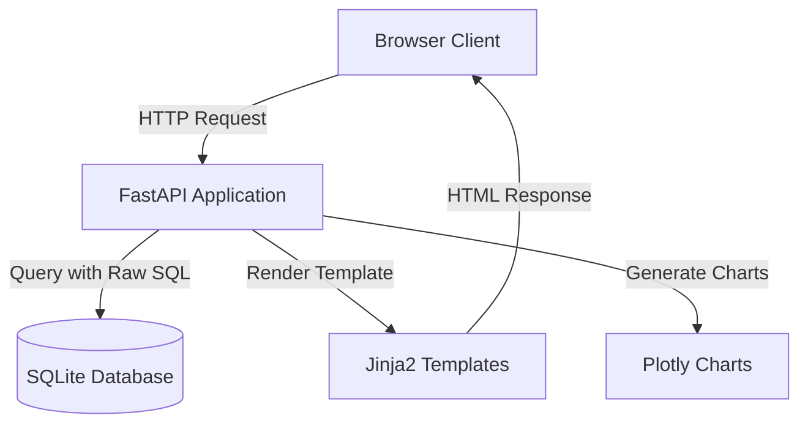

# FastAPI Dashboard Recreation Plan

## Architecture Overview

The FastAPI implementation will mirror the Django dashboard functionality:



## Project Structure

Create the following structure in the `fastapi` folder:

```
fastapi/
├── main.py                 # FastAPI app entry point
├── database.py             # Database connection and raw SQL queries
├── schemas.py              # Pydantic models for data validation
├── routes.py               # Route handlers for dashboard views
├── charts.py               # Plotly chart generation logic
├── import_csv.py           # CLI script for importing CSV data
├── templates/              # Jinja2 templates
│   ├── base.html          # Base template (port from Django)
│   ├── index.html         # Dashboard homepage
│   └── city_detail.html   # City detail page
├── static/                 # Static files (CSS, JS if needed)
├── requirements.txt        # Python dependencies
└── db.sqlite3             # Separate SQLite database
```

## Implementation Details

### 1. Database Setup (`database.py`)

- Create a separate SQLite database connection using `sqlite3` module (no ORM)
- Implement raw SQL queries for:
  - Creating the `job_data` table with schema: `id`, `date`, `location`, `job_count`
  - Indexes on `date`, `location`, and composite index on `(date, location)`
  - Unique constraint on `(date, location)`
- Connection pooling using `contextlib.contextmanager` for safe database access
- SQL queries to mirror Django ORM queries:
  - Get latest date: `SELECT MAX(date) FROM job_data`
  - Get latest data by location: `SELECT * FROM job_data WHERE date = ? ORDER BY job_count DESC`
  - Get all data ordered: `SELECT * FROM job_data ORDER BY date, location`
  - Get city data: `SELECT * FROM job_data WHERE location = ? ORDER BY date`

### 2. Data Models (`schemas.py`)

Create Pydantic models for type validation and data structure:

```python
class JobDataSchema:
    date: date
    location: str
    job_count: int
```

These won't interact with the database but will structure the data returned from raw SQL queries.

### 3. Routes (`routes.py` and `main.py`)

Implement two main routes matching Django URL patterns:

- **GET `/`** - Dashboard index view
  - Execute raw SQL to get latest date and job counts
  - Generate summary statistics (total jobs, city count)
  - Fetch all historical data for charts
  - Render `index.html` template with context

- **GET `/city/{location}`** - City detail view
  - Execute raw SQL to get all data for specific location
  - Calculate statistics (current, average, max, min)
  - Render `city_detail.html` template with context

### 4. Chart Generation (`charts.py`)

Port Plotly chart generation logic from Django views:

- **Time series chart**: Multi-line chart showing job counts over time by location
  - Use Plotly Express `px.line()` with same styling as Django version
  - Return HTML string with `to_html(full_html=False, include_plotlyjs='cdn')`

- **Bar chart**: Current job counts by city
  - Use Plotly Express `px.bar()` with color scale
  - Same styling and layout as Django version

### 5. Templates (`templates/`)

Port Django templates to Jinja2:

- **`base.html`**: Copy the entire Django base template (already uses Jinja2-compatible syntax)
  - Update URL generation from `` to `/` and `/city/{location}`

- **`index.html`**: Port dashboard homepage
  - Display latest date, total jobs, cities tracked
  - City list with links to detail pages
  - Embed bar chart and time series chart HTML

- **`city_detail.html`**: Port city detail page
  - Display statistics cards (current, average, max, min)
  - Embed trend chart
  - Historical data table

### 6. CSV Import (`import_csv.py`)

Standalone Python script for importing CSV data:

- Accept command-line arguments: `--file` (CSV path), `--clear` (clear existing data)
- Use pandas to read CSV file from `data/data.csv`
- Parse dates and validate data
- Execute raw SQL INSERT statements with `INSERT OR IGNORE` for duplicates
- Support bulk insert using `executemany()`
- Print progress and summary (records imported, duplicates skipped)

### 7. Dependencies (`requirements.txt`)

```
fastapi
uvicorn[standard]
jinja2
plotly
pandas
python-multipart
aiofiles
```

### 8. FastAPI Application Setup (`main.py`)

- Initialize FastAPI app
- Mount Jinja2 template engine
- Mount static files directory
- Include routes from `routes.py`
- Add startup event to initialize database schema
- Configure CORS if needed
- Add root redirect or serve dashboard directly at `/`

## Database Schema

The raw SQL for creating the table:

```sql
CREATE TABLE IF NOT EXISTS job_data (
    id INTEGER PRIMARY KEY AUTOINCREMENT,
    date DATE NOT NULL,
    location VARCHAR(100) NOT NULL,
    job_count INTEGER NOT NULL,
    UNIQUE(date, location)
);

CREATE INDEX IF NOT EXISTS idx_date ON job_data(date);
CREATE INDEX IF NOT EXISTS idx_location ON job_data(location);
CREATE INDEX IF NOT EXISTS idx_date_location ON job_data(date, location);
```

## Key Differences from Django

1. **No ORM**: All database operations use raw SQL with `sqlite3` module
2. **Manual connection management**: Context managers for database connections
3. **Jinja2 instead of Django templates**: Syntax is similar but URL generation differs
4. **Manual transaction handling**: Use `conn.commit()` explicitly
5. **Import script is standalone**: Not a management command, run directly with Python
6. **Async support**: FastAPI routes can be async (though not required for SQLite)

## Testing Strategy

After implementation:

1. Run the import script to populate the database with CSV data
2. Start FastAPI server with `uvicorn main:app --reload`
3. Verify dashboard at `http://localhost:8000/`
4. Test city detail pages by clicking on city names
5. Compare visual output with Django dashboard
6. Verify all charts render correctly
7. Check SQL queries execute without errors