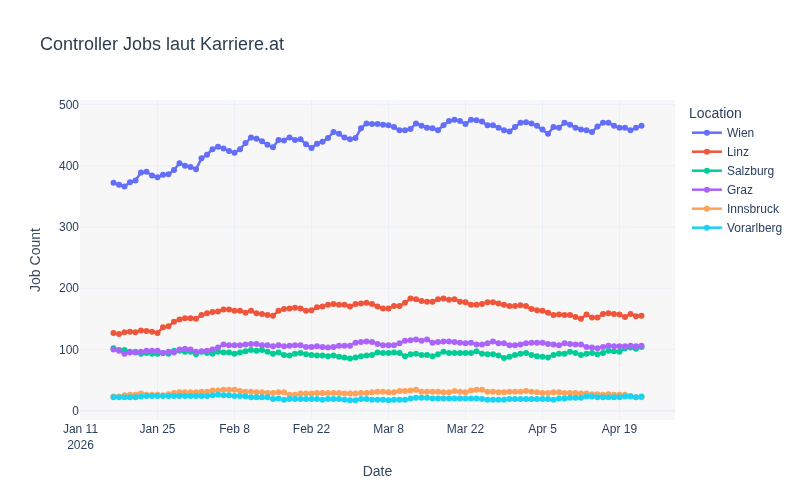

# Job Market Watch Austria

A simple automated job market tracker that monitors Controller positions across Austrian cities on Karriere.at. The project uses a GitHub Action to scrape job data daily and stores the results in a CSV file.

## Overview

This repository contains a daily scraping job that tracks the number of Controller job postings in major Austrian cities (Wien, Linz, Salzburg, Graz, Innsbruck, and Vorarlberg). The data is automatically collected every day and visualized to show trends over time.

## How It Works

- **Automated Scraping**: A GitHub Action runs daily to scrape job counts from Karriere.at
- **Data Storage**: Results are appended to `data/data.csv`
- **Visualization**: Python script generates trend plots using Plotly

## Project Structure

- `data/` - Contains the CSV data file and generated visualizations
- `.github/workflows/` - GitHub Actions workflow for daily scraping
- `scrape.py` - Main scraping script

## Data Format

The CSV file contains the following columns:
- `date` - Date of the scrape
- `location` - City name
- `job_count` - Number of Controller job postings

## Requirements

- Python 3.14+
- `uv` package manager
- Dependencies managed in `pyproject.toml`
